# MacLib

> **A macOS-inspired Roblox UI library** for polished windows, responsive overlays, configurable controls, and live community widgets.

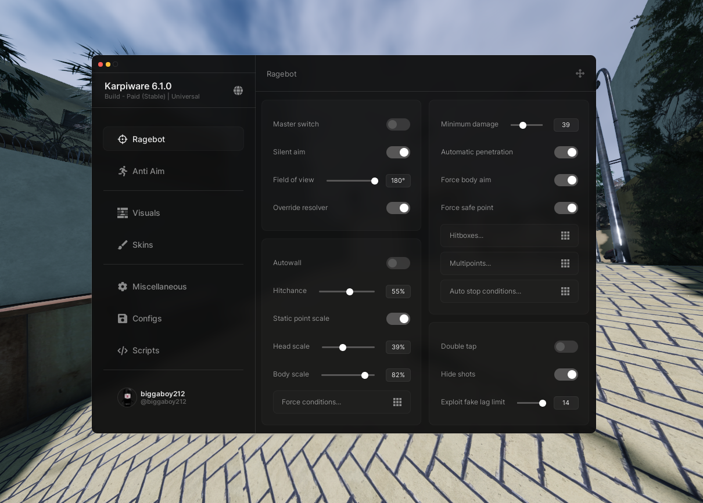

MacLib is distributed as a single Lua file, [`maclib.txt`](./maclib.txt). It provides a practical foundation for tabbed interfaces, rich controls, notifications, dialogs, mobile recovery controls, automatic viewport scaling, player stats, and Discord invite cards.

---

## At a glance

| Resource | Location |
|---|---|
| **Source code** | [`maclib.txt`](./maclib.txt) |
| **Copy-paste quick start** | [`examples/quick-start.lua`](./examples/quick-start.lua) |
| **Full working example** | [`examples/test.lua`](./examples/test.lua) |
| **Repository** | [RedzZhub654/MacLib](https://github.com/RedzZhub654/MacLib) |
| **Local UI screenshots** | [`assets/maclib-docs`](./assets/maclib-docs) |
| **Image provenance** | [`assets/maclib-docs/SOURCES.md`](./assets/maclib-docs/SOURCES.md) |
| **Original documentation** | [MacLib UI Library][1] |
| **Original project** | [biggaboy212/Maclib][2] |

> **Recommended route:** run the [copy-paste quick start](#quick-start) first. It creates a minimal working window, then move to the full feature test after that succeeds.

---

## Quick start

### Copy this entire command

This is the recommended first run. It executes [`examples/quick-start.lua`](./examples/quick-start.lua), which **loads MacLib and creates a visible window**. It also prints a readable warning if the library or window cannot initialize.

```lua
loadstring(game:HttpGet(
    "https://raw.githubusercontent.com/RedzZhub654/MacLib/main/examples/quick-start.lua"
))()
```

> **Expected result:** a window titled **MacLib Quick Start** appears. Press **RightControl** to hide or restore it, and use **Show notification** to verify the button callback.

### Run the full feature test

When the quick start works, run the complete example for player stats, responsive scaling, palettes, the Discord invite card, and every major control.

```lua
loadstring(game:HttpGet(
    "https://raw.githubusercontent.com/RedzZhub654/MacLib/main/examples/test.lua"
))()
```

### Use MacLib as a module

The library loader below only returns the `MacLib` table; on its own, it **does not** display a UI. Follow it by creating a window, as shown in the next section.

```lua
local MacLib = loadstring(game:HttpGet(
    "https://raw.githubusercontent.com/RedzZhub654/MacLib/main/maclib.txt"
))()
```

---

## Create your first window

A window is the root of a MacLib interface. Start small, then enable the optional pieces as your project requires.

```lua
local Window = MacLib:Window({
    Title = "My Hub",
    Subtitle = "Ready to go",
    Size = UDim2.fromOffset(900, 650),

    Keybind = Enum.KeyCode.RightControl,
    AcrylicBlur = true,
    AutoDPI = true,

    MobileFloatButton = true,
    PlayerStatsEnabled = true,
    PlayerStatsBadge = "LIVE",
})
```

### Core options

| Option | Purpose |
|---|---|
| `Title`, `Subtitle` | Define the primary window text. |
| `Size` | Sets initial window dimensions; defaults to `868 × 650`. |
| `Keybind` | Toggles the visible state; defaults to `RightControl`. |
| `DragStyle` | Uses the drag icon (`1`) or the full window (`2`) as the drag target. |
| `ShowUserInfo` | Displays the local-player block in the sidebar. |
| `AcrylicBlur` | Controls the background blur treatment. |
| `DisabledWindowControls` | Disables named controls such as `"Exit"` or `"Minimize"`. |

---

## Build a layout

MacLib follows a straightforward structure: **Window → Tab Group → Tab → Section → Control**. Tabs organize pages, while sections place controls in the left or right column. [3] [4] [5]

```lua
local TabGroup = Window:TabGroup()

local MainTab = TabGroup:Tab({
    Name = "Main",
    Image = "rbxassetid://10723426393",
})

local Left = MainTab:Section({ Side = "Left" })
local Right = MainTab:Section({ Side = "Right" })

Left:Header({ Text = "Controls" })
Left:Paragraph({
    Header = "Welcome",
    Body = "Add controls below this text.",
})

MainTab:Select()
```

| Tab navigation | Two-column sections |
|---|---|
| 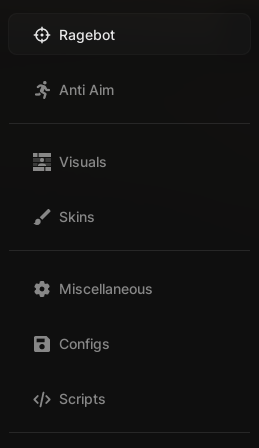 | 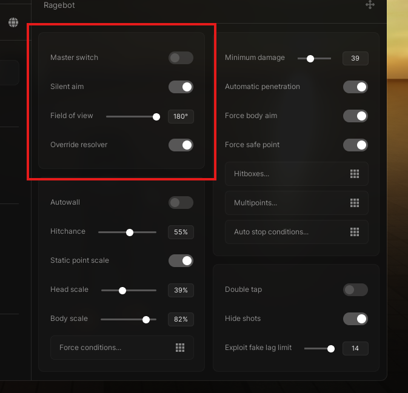 |

---

## Responsive experience

### Automatic DPI scaling

MacLib automatically adapts the main window to the active camera viewport. It recalculates after a resize, device rotation, or camera change. The player-stats card now also resizes its **frame and internal content** independently against both viewport width and height, so it remains compact even when main-window DPI scaling is disabled. Floating controls are clamped to the visible screen.

```lua
AutoDPI = true,
AutoDPIMinScale = 0.35,
AutoDPIMargin = 32,
```

| Setting or method | Effect |
|---|---|
| `AutoDPI` | Enables viewport-aware scaling. It is enabled by default. |
| `AutoDPIMinScale` | Sets the minimum allowed main-window scale. |
| `AutoDPIMargin` | Reserves viewport edge space during scaling. |
| `Window:SetAutoDPI(boolean)` | Enables or disables automatic updates at runtime. |
| `Window:GetAutoDPI()` | Returns the current automatic-scaling state. |
| `Window:SetScale(number)` | Switches to manual scale control. |

### Mobile recovery button

On touch-only devices, a circular menu button is displayed whenever `MobileFloatButton` is enabled. It remains visible while the main UI is open **and** when it is minimized; a tap toggles the window, while a drag repositions the button. The button is kept inside the active viewport, even after a resize or orientation change.

```lua
MobileFloatButton = true,
MobileFloatButtonPosition = UDim2.new(1, -24, 1, -24),
```

### Floating player stats

The player-stats overlay stays visible while the main interface is minimized. It displays the local Roblox avatar and display name, plus live ping, FPS, and server population.

```lua
PlayerStatsEnabled = true,
PlayerStatsAutoDPI = true,
PlayerStatsMargin = 16,
PlayerStatsBadge = "LIVE",
PlayerStatsPosition = UDim2.new(0.5, 0, 0, 16),
PlayerStatsDraggable = true,

-- Optional override:
-- PlayerStatsAvatar = "rbxassetid://YOUR_IMAGE_ID",
```

| Value | Source |
|---|---|
| **Avatar and name** | Local Roblox player; the avatar can be overridden. |
| **Ping** | Roblox `Stats` service, with a safe unavailable fallback. |
| **FPS** | Render-step measurement. |
| **Players** | `Players:GetPlayers()` in the active server. |

| Player-stats setting | Purpose |
|---|---|
| `PlayerStatsAutoDPI` | Enables independent responsive sizing for the card and its content. It is enabled by default. |
| `PlayerStatsMargin` | Sets the viewport edge space used when calculating player-stats size; defaults to `16`. |

---

## Brand the window

MacLib displays `rbxassetid://137471163061841` beside the title by default. The title block automatically reserves space for both the hub logo and the global-settings button.

```lua
local Window = MacLib:Window({
    Title = "My Hub",
    Subtitle = "Branded interface",

    -- Default logo is used when this is omitted.
    -- HubLogo = "rbxassetid://YOUR_IMAGE_ID", -- Optional override
    -- HubLogo = false,                         -- Optional hide
    HubLogoColor = Color3.fromRGB(255, 255, 255),
})
```

| Option | Default | Purpose |
|---|---|---|
| `HubLogo` | `rbxassetid://137471163061841` | Uses the default asset, another image asset, or `false` to hide the logo. |
| `HubLogoColor` | White | Applies a tint to a monochrome or tintable image. |

---

## Customize your own visuals

MacLib preserves its own core styling, while a palette table gives your feature callbacks a clean place to keep custom colors. The test interface contains four palettes: **Sunset**, **Ocean**, **Forest**, and **Lavender**.

```lua
local Palette = {
    Accent = Color3.fromRGB(74, 166, 255),
    Background = Color3.fromRGB(19, 30, 46),
    Surface = Color3.fromRGB(31, 60, 88),
    Text = Color3.fromRGB(235, 247, 255),
}

Section:Colorpicker({
    Name = "Accent color",
    Default = Palette.Accent,
    Alpha = 0,
    Callback = function(color)
        print("Apply this color to your own feature:", color)
    end,
})
```

| Palette | Accent | Background | Surface |
|---|---:|---:|---:|
| **Sunset** | `244, 101, 92` | `30, 24, 28` | `58, 37, 43` |
| **Ocean** | `74, 166, 255` | `19, 30, 46` | `31, 60, 88` |
| **Forest** | `105, 196, 132` | `22, 34, 27` | `39, 71, 49` |
| **Lavender** | `173, 134, 255` | `33, 27, 47` | `63, 48, 91` |

---

## Add controls

Interactive controls can receive an optional **flag** as their second argument. Flags allow values to participate in MacLib configuration storage. The original API reference provides the complete field and method details. [6]

| Control | Use it for |
|---|---|
| `Section:Button` | Invoking an action. |
| `Section:Toggle` | Tracking a boolean state. |
| `Section:Slider` | Choosing a numeric range. |
| `Section:Input` | Capturing text. |
| `Section:Dropdown` | Choosing one or more values. |
| `Section:Keybind` | Binding a Roblox input. |
| `Section:Colorpicker` | Selecting color and transparency. |
| `Section:Header`, `Paragraph`, `Label`, `SubLabel` | Presenting explanatory text. |
| `Section:Divider`, `Spacer` | Creating visual separation. |

```lua
local Enabled = Left:Toggle({
    Name = "Enable feature",
    Default = false,
    Callback = function(value)
        print("Enabled:", value)
    end,
}, "FeatureEnabled")

local Amount = Left:Slider({
    Name = "Amount",
    Default = 50,
    Minimum = 0,
    Maximum = 100,
    DisplayMethod = "Percent",
    Precision = 0,
    Callback = function(value)
        print("Amount:", value)
    end,
}, "Amount")

Left:Button({
    Name = "Show current values",
    Callback = function()
        print(Enabled:GetState(), Amount:GetValue())
    end,
})
```

---

## Show feedback

Use notifications for short-lived status messages and dialogs when the player must confirm a choice. Both objects can be updated or canceled after creation. [7] [8]

```lua
Window:Notify({
    Title = "Saved",
    Description = "Your settings were saved.",
    Lifetime = 3,
})

Window:Dialog({
    Title = "Reset settings?",
    Description = "This demonstrates a confirmation flow.",
    Buttons = {
        {
            Name = "Confirm",
            Callback = function()
                print("Confirmed")
            end,
        },
        { Name = "Cancel" },
    },
})
```

---

## Discord invite widget

`Tab:CreateDiscordInvite(config)` creates a community card in either tab column. It supports optional Roblox icon and banner assets, copy-link feedback, and live online and total member counts. The widget uses Discord’s public invite endpoint with `with_counts=true`, which returns the approximate presence and member count fields. [10]

```lua
local Card = MainTab:CreateDiscordInvite({
    Title = "Discord Developers",
    Description = "A live public invite example.",

    Icon = "rbxassetid://YOUR_SERVER_ICON",     -- Optional
    Banner = "rbxassetid://YOUR_SERVER_BANNER", -- Optional
    Link = "https://discord.gg/discord-developers",

    Button = "Copy Invite",
    Side = 2,
    RefreshInterval = 5,

    OnCopy = function(link, copied)
        print("Invite:", link, "Copied:", copied)
    end,
})
```

### Configuration

| Property | Default | Notes |
|---|---|---|
| `Title` | `"Discord Server"` | Uses the returned server name when omitted and available. |
| `Description` | Empty | Uses the returned server description when omitted and available. |
| `Icon`, `Banner` | Empty | Optional Roblox asset IDs; a gradient fills the banner space when omitted. |
| `Link` | Empty | Full Discord URL or invite code. |
| `Button` | `"Join Server"` | Copy-action label. |
| `Side` | `1` | Use `1` or `"Left"`; use `2` or `"Right"` for the other column. |
| `RefreshInterval` | `5` seconds | Live-stat cadence; values below five seconds are raised to five. |
| `OnCopy` | None | Receives `link` and the clipboard success flag. |

### Card methods

| Method | Purpose |
|---|---|
| `Card:GetFrame()` | Returns the underlying widget frame. |
| `Card:SetTitle(value)` | Updates the title. |
| `Card:SetDescription(value)` | Updates the supporting text. |
| `Card:SetLink(value)` | Changes the link and requests a refresh. |
| `Card:Refresh()` | Requests fresh public live counts now. |
| `Card:Destroy()` | Stops future refreshes and removes the card. |

> Live counts are best-effort. An invalid invite, unavailable HTTP access, or rate-limited response leaves the card available but marks its statistics as unavailable. The copy action uses the clipboard API offered by the host environment and otherwise reports **Link Ready**.

---

## Window and configuration API

| Method | Purpose |
|---|---|
| `Window:SetState(boolean)` / `Window:GetState()` | Changes or reads main-window visibility. |
| `Window:SetNotificationsState(boolean)` | Shows or hides the notification area. |
| `Window:SetAcrylicBlurState(boolean)` | Changes the blur state. |
| `Window:SetUserInfoState(boolean)` | Shows or redacts sidebar user information. |
| `Window:SetSize(UDim2)` / `Window:GetSize()` | Changes or reads window dimensions. |
| `Window:SetScale(number)` / `Window:GetScale()` | Uses or reads a manual scale. |
| `Window:UpdateTitle(string)` | Changes the title after creation. |
| `Window:UpdateSubtitle(string)` | Changes the subtitle after creation. |
| `Window:Unload()` | Cleans up the full interface and floating overlays. |
| `MacLib:SetFolder(string)` | Chooses the configuration folder. |
| `MacLib:SaveConfig(path)` / `MacLib:LoadConfig(path)` | Saves or restores flagged controls. |
| `MacLib:RefreshConfigList()` | Lists available configuration names. |
| `MacLib:LoadAutoLoadConfig()` | Loads the selected automatic configuration. |
| `MacLib:Demo()` | Opens the built-in demonstration. |

---

## Visual reference

The component screenshots below are stored locally in this repository. Their original documentation pages and media URLs are recorded in [`assets/maclib-docs/SOURCES.md`](./assets/maclib-docs/SOURCES.md).

### Feedback and settings

| Global setting | Notification | Dialog |
|---|---|---|
| 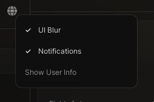 | 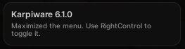 | 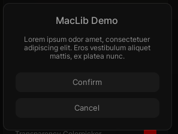 |

### Inputs

| Button | Input | Slider |
|---|---|---|
| 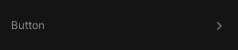 | 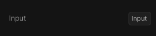 | 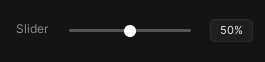 |

| Toggle | Keybind | Color picker |
|---|---|---|
| 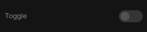 | 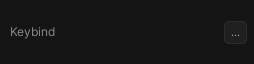 | 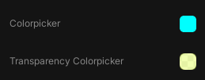 |

| Dropdown | Header | Paragraph |
|---|---|---|
| 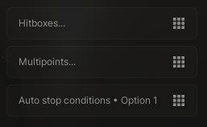 | 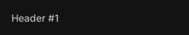 | 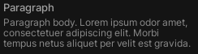 |

### Supporting elements

| Label | Sub-label | Divider |
|---|---|---|
| 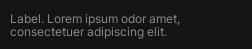 | 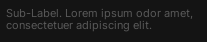 | 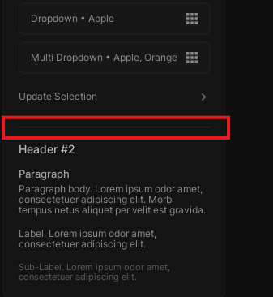 |

---

## Credits and sources

This is an original repository guide that preserves credit to the MacLib project. The public documentation credits **biggaboy212** as UI designer, lead developer, and programmer. [9]

[1]: https://brady-xyz.gitbook.io/maclib-ui-library "MacLib UI Library documentation"
[2]: https://github.com/biggaboy212/Maclib/tree/main "Original MacLib repository"
[3]: https://brady-xyz.gitbook.io/maclib-ui-library/getting-started/loading-maclib/creating-a-window/creating-a-tab-group "Creating a tab group"
[4]: https://brady-xyz.gitbook.io/maclib-ui-library/getting-started/loading-maclib/creating-a-window/creating-a-tab-group/adding-tabs "Adding tabs"
[5]: https://brady-xyz.gitbook.io/maclib-ui-library/getting-started/loading-maclib/creating-a-window/creating-a-tab-group/adding-tabs/adding-sections "Adding sections"
[6]: https://brady-xyz.gitbook.io/maclib-ui-library/llms.txt "MacLib documentation index"
[7]: https://brady-xyz.gitbook.io/maclib-ui-library/getting-started/loading-maclib/creating-a-window/displaying-a-notification "Displaying a notification"
[8]: https://brady-xyz.gitbook.io/maclib-ui-library/getting-started/loading-maclib/creating-a-window/prompting-a-dialog "Prompting a dialog"
[9]: https://brady-xyz.gitbook.io/maclib-ui-library/information/miscellaneous "MacLib credits and links"
[10]: https://docs.discord.com/developers/resources/invite "Discord Invite Resource"
