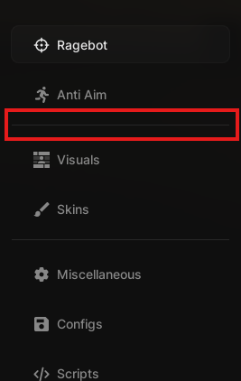
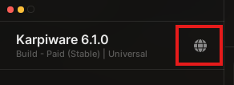

# MacLib

> A macOS-inspired Roblox UI library for creating windows, organized navigation, configurable controls, notifications, and dialogs.

**MacLib** is a Lua UI library distributed in this repository as [`maclib.txt`](./maclib.txt). This README is an original repository guide based on the public MacLib documentation, with the library link updated to this repository. The upstream documentation describes a modern, customizable interface and a broad set of UI controls. For the complete API reference, consult the [official documentation hub][1].

| Resource | Location |
|---|---|
| **Repository** | [github.com/RedzZhub654/MacLib](https://github.com/RedzZhub654/MacLib) |
| **Library file** | [`maclib.txt`](./maclib.txt) |
| **Load URL** | `https://raw.githubusercontent.com/RedzZhub654/MacLib/main/maclib.txt` |
| **Original documentation** | [MacLib UI Library][1] |
| **Original project** | [biggaboy212/Maclib][2] |

The images used below are stored in this repository under [`assets/maclib-docs`](./assets/maclib-docs), so the README does not depend on the external documentation site for its visual examples. Each asset’s original source page is recorded in [`SOURCES.md`](./assets/maclib-docs/SOURCES.md).


## Getting started

MacLib is loaded as a Lua module and then used to create a window. The loader below has been changed from the documentation’s original upstream URL so that it retrieves the `maclib.txt` file in **this** repository. Before executing remotely fetched code, inspect the revision you intend to use and consider pinning the URL to a commit SHA for reproducible builds.

```lua
local MacLib = loadstring(game:HttpGet(
    "https://raw.githubusercontent.com/RedzZhub654/MacLib/main/maclib.txt"
))()
```

Once loaded, construct a window and populate it with tab groups, tabs, sections, and controls. The public guide documents options for a title, subtitle, size, dragging behavior, control visibility, user details, hotkeys, and acrylic blur. It also provides methods for updating window state, notifications, blur, user-info visibility, keybindings, size, scale, and display text. [3]

```lua
local Window = MacLib:Window({
    Title = "My Project",
    Subtitle = "MacLib",
    Size = UDim2.fromOffset(868, 650),
    DragStyle = 1,
    DisabledWindowControls = {},
    ShowUserInfo = true,
    Keybind = Enum.KeyCode.RightControl,
    AcrylicBlur = true,
})
```



| Window option | Purpose |
|---|---|
| `Title`, `Subtitle` | Set the primary and supporting text displayed in the interface. |
| `Size` | Supplies the initial `UDim2` dimensions of the window. |
| `DragStyle` | Chooses icon-based dragging or whole-window dragging for different input contexts. |
| `DisabledWindowControls` | Disables named controls such as exit or minimize. |
| `ShowUserInfo` | Displays or redacts user details in the UI. |
| `Keybind` | Selects the key used to toggle window visibility. |
| `AcrylicBlur` | Enables or disables the window blur treatment. |

## Library lifecycle and configuration

The documented library-level API includes a demo window and configuration management. You can choose a configuration folder, save a flagged control state, load it later, list saved configurations, and load a configuration selected for automatic use. Configuration-aware controls expose a flag parameter and can opt out through `IgnoreConfig`. [4]

| Method | Role |
|---|---|
| `MacLib:Demo()` | Opens the library’s demonstration window. |
| `MacLib:SetFolder(folder)` | Sets the folder used to store configurations. |
| `MacLib:SaveConfig(path)` | Saves tracked element values to a configuration file. |
| `MacLib:LoadConfig(path)` | Restores a saved configuration. |
| `MacLib:RefreshConfigList()` | Returns the available configuration names. |
| `MacLib:LoadAutoLoadConfig()` | Loads the selected automatic configuration. |
| `Window:Unload()` | Destroys the UI window. |
| `Window.onUnloaded(callback)` | Registers work to perform immediately before unload. |

## Organizing the interface

The documented hierarchy is **Window → Tab Group → Tab → Section → Control**. A tab group separates tabs visually, a tab supplies its name and optional small image, and a section places controls on the left or right side. Tabs can be selected programmatically and can host a configuration section. [5] [6] [7]

```lua
local Group = Window:TabGroup()
local Tab = Group:Tab({
    Name = "Main",
    Image = "rbxassetid://0",
})
local Section = Tab:Section({ Side = "Left" })
```

| Tab layout | Section layout |
|---|---|
|  |  |

| Layer | Creation method | Main responsibility |
|---|---|---|
| Tab group | `Window:TabGroup()` | Visually groups related tabs. |
| Tab | `Group:Tab({...})` | Names a workspace and may show a compact image. |
| Section | `Tab:Section({...})` | Places controls in the `Left` or `Right` column. |
| Global setting | `Window:GlobalSetting({...})` | Adds a boolean option to the window-level settings area. |

## Interaction feedback

MacLib provides UI-level notifications and dialogs. Notifications accept title, description, lifetime, size and scale settings, an optional interaction style, and a callback; returned notification objects can update their text, resize, or cancel. Dialogs accept a title, description, and a collection of named callback buttons; returned dialog objects can update text or cancel. [8] [9]

| Global settings | Notification | Dialog |
|---|---|---|
|  |  |  |

| Feature | Key capability | Useful object methods |
|---|---|---|
| Global setting | A boolean setting available from the window’s global-settings menu. | Uses a callback to receive the new state. |
| Notification | A transient alert with optional confirm or cancel affordance. | `UpdateTitle`, `UpdateDescription`, `Resize`, `Cancel` |
| Dialog | A named-button prompt for a user decision. | `UpdateTitle`, `UpdateDescription`, `Cancel` |

## Controls

The source documentation covers action, text-entry, numeric, boolean, key-binding, color, and choice controls. These controls typically accept an optional flag for configuration persistence; interactive controls expose a value or state and can be hidden or renamed after creation. [10]

| Control | What it provides | Notable update or query operations |
|---|---|---|
| `Button` | Named action that invokes a callback. | Rename; toggle visibility. |
| `Input` | Text entry with built-in or custom character filtering. | Read or replace input text; change placeholder. |
| `Slider` | Numeric value between a minimum and maximum with display formatting. | Update or retrieve value. |
| `Toggle` | Boolean state control. | Update or retrieve state. |
| `Keybind` | User-selectable Roblox enum key with optional blacklist and hold handling. | Bind, unbind, or retrieve the key. |
| `Colorpicker` | `Color3` selection with optional alpha/transparency. | Set color or alpha. |
| `Dropdown` | Single- or multi-select choices with optional search and required selection. | Update selection; insert, remove, query, or clear options. |

| Button | Input | Slider |
|---|---|---|
|  |  |  |

| Toggle | Keybind | Color picker |
|---|---|---|
|  |  |  |

| Dropdown | Header | Paragraph |
|---|---|---|
|  |  |  |

The library also includes lightweight content and layout elements. Headers, labels, sub-labels, and paragraphs provide presentation text; dividers and spacers structure a section without collecting user input. Their documented APIs support visibility changes, text updates where applicable, and removal for divider or spacer elements. [11]

| Element | Primary use |
|---|---|
| `Header` | Renders a prominent text heading. |
| `Paragraph` | Renders a header paired with explanatory body text. |
| `Label` / `SubLabel` | Renders standalone primary or secondary text. |
| `Divider` | Separates neighboring controls visually. |
| `Spacer` | Adds empty vertical separation. |

| Label | Sub-label | Divider |
|---|---|---|
|  |  |  |

## Documentation notation

The original documentation uses a compact type notation. Angle brackets show a parameter’s expected type, an ellipsis denotes a variable-length collection, and `or` indicates alternate accepted types. Method signatures that include a trailing type describe a return value, while `void` means no value is returned. [12]

| Notation | Meaning |
|---|---|
| `Name <string>` | A parameter named `Name` that accepts text. |
| `Items <...table: fieldA, fieldB>` | A variable-length set of tables containing the listed fields. |
| `Value <number or table>` | A value that may be a number or a table. |
| `Callback <function(): void>` | A callback that returns no value. |
| `:GetState(: boolean)` | A method that returns a boolean state. |

## Visual asset archive

All **24** source documentation visuals have been copied locally into [`assets/maclib-docs`](./assets/maclib-docs) and are embedded in this README. The accompanying [`SOURCES.md`](./assets/maclib-docs/SOURCES.md) provides a per-file provenance table linking each local image to its documentation page and original media URL.

| Welcome cover | Loading guide | Documentation guide |
|---|---|---|
|  |  |  |

| Reference links | Global settings menu | Interface organization |
|---|---|---|
|  |  |  |

## Attribution and references

This repository README was written as a practical guide rather than a verbatim copy of the public docs. It preserves attribution to the original project and directs readers to the official documentation for full, current API details. The documentation credits **biggaboy212** as the UI designer, lead developer, and programmer. [13]

[1]: https://brady-xyz.gitbook.io/maclib-ui-library "MacLib UI Library documentation"
[2]: https://github.com/biggaboy212/Maclib/tree/main "Original MacLib repository"
[3]: https://brady-xyz.gitbook.io/maclib-ui-library/getting-started/loading-maclib/creating-a-window "Creating a window"
[4]: https://brady-xyz.gitbook.io/maclib-ui-library/getting-started/loading-maclib "Loading MacLib"
[5]: https://brady-xyz.gitbook.io/maclib-ui-library/getting-started/loading-maclib/creating-a-window/creating-a-tab-group "Creating a tab group"
[6]: https://brady-xyz.gitbook.io/maclib-ui-library/getting-started/loading-maclib/creating-a-window/creating-a-tab-group/adding-tabs "Adding tabs"
[7]: https://brady-xyz.gitbook.io/maclib-ui-library/getting-started/loading-maclib/creating-a-window/creating-a-tab-group/adding-tabs/adding-sections "Adding sections"
[8]: https://brady-xyz.gitbook.io/maclib-ui-library/getting-started/loading-maclib/creating-a-window/adding-a-global-setting "Adding a global setting"
[9]: https://brady-xyz.gitbook.io/maclib-ui-library/getting-started/loading-maclib/creating-a-window/displaying-a-notification "Displaying a notification"
[10]: https://brady-xyz.gitbook.io/maclib-ui-library/llms.txt "MacLib documentation index"
[11]: https://brady-xyz.gitbook.io/maclib-ui-library/getting-started/loading-maclib/creating-a-window/creating-a-tab-group/adding-tabs/adding-sections/paragraph "Paragraph control"
[12]: https://brady-xyz.gitbook.io/maclib-ui-library/information/documentation-formatting "Documentation formatting"
[13]: https://brady-xyz.gitbook.io/maclib-ui-library/information/miscellaneous "MacLib credits and links"
